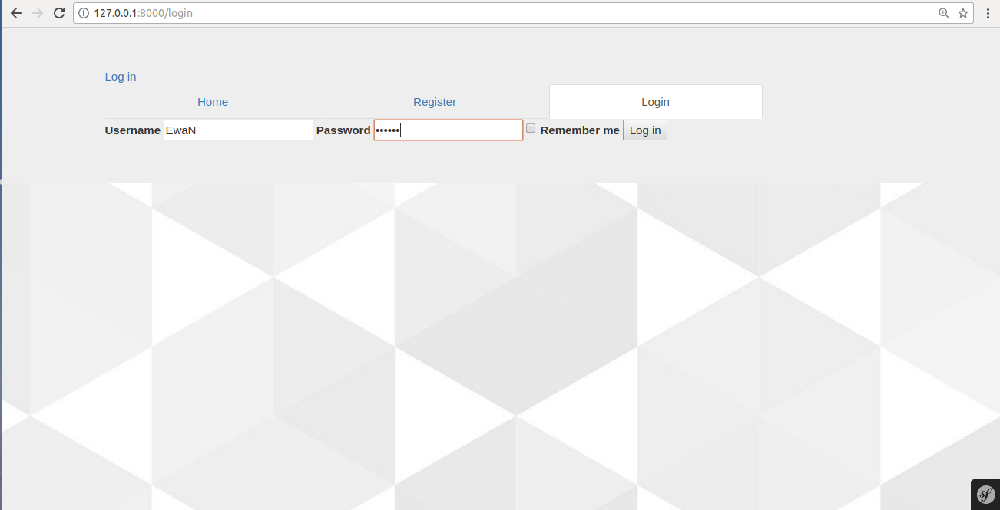
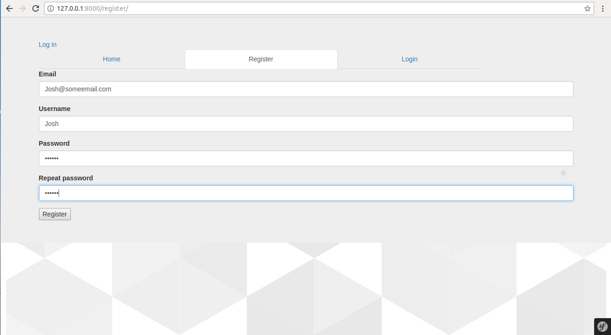
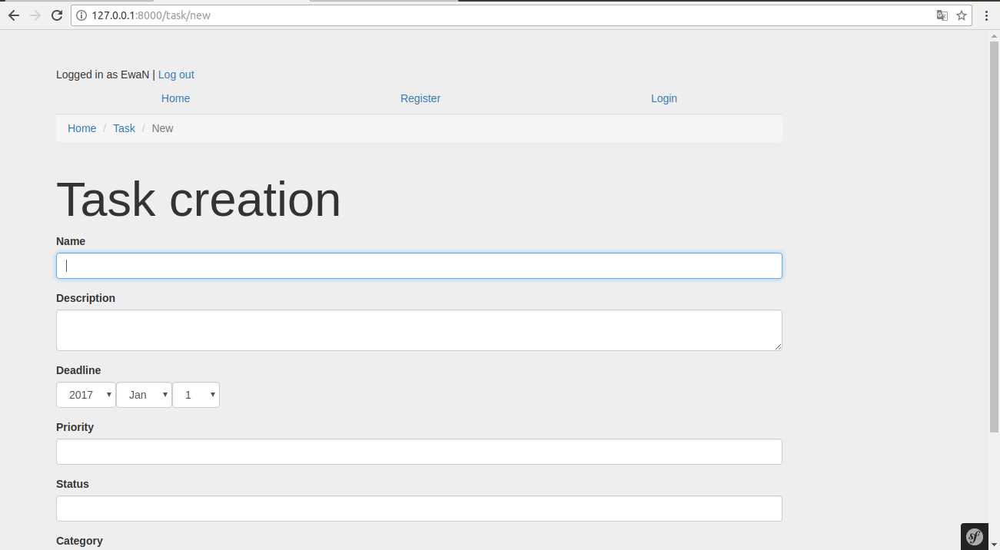
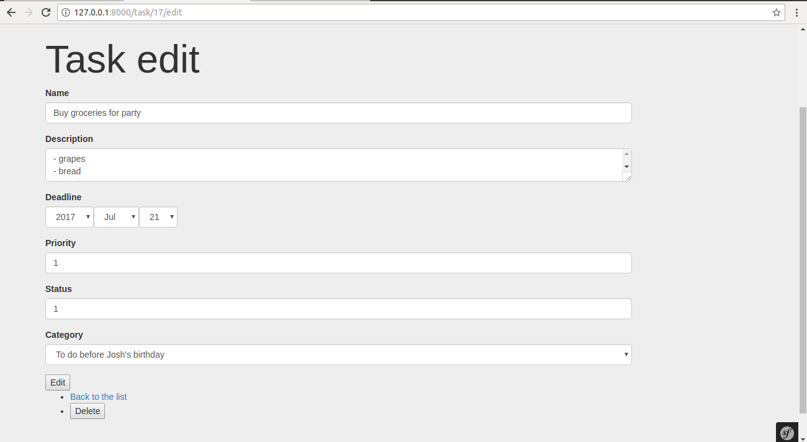

# Task planner
### czyli warsztat ostateczny  
__na kursie "Become Back-end developer"__

Celem ostatniego warsztatu na kursie jest stworzenie i zaprezentowanie aplikacji do planowania zadań.

W moim przypadku tworzenie aplikacji nadal jest w toku, niemniej jest ona już gotowa na tyle, 
bym mogła zaprezentować przynajmniej tak podstawowe funkcje jak: rejestracja, logowanie, dodawanie zadań,
kategorii i komentarzy dla nich. 

Stopniowo aplikacja będzie uzupełniana o nowe funkcjonalności oraz rozwiązania z dziedziny user experience.
Na przykład - dodawanie statusu i priorytetu zadań obecnie odbywa się na podstawie wpisania dowolnego tekstu, 
będą one hasłami z listy ( np. "urgent", "minor", "done", "undone").

Aplikacja tworzona jest z zastosowaniem frameworku Symfony ( w wersji 2.8) i bundle KnpMenu, oraz frameworku Bootstrap.

### Oto zrzuty ekranu z przykładowych stron aplikacji

Strona logowania:

Strona rejestracji:

Strona dodawania zadania:

Strona edycji zadania:

